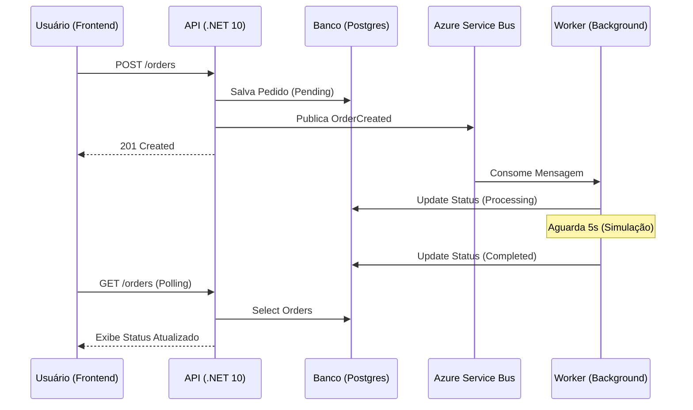

# 📦 TMB Order System

Sistema de gestão de pedidos baseado em arquitetura orientada a eventos (EDA). O projeto utiliza **.NET 10** no backend, **Next.js 16** no frontend e **Azure Service Bus** para mensageria, totalmente orquestrado via **Docker**.

## 🚀 Tecnologias

* **Backend:** .NET 10 (Preview), Entity Framework Core, Health Checks.
* **Frontend:** Next.js 16 (App Router), TailwindCSS v4.
* **Banco de Dados:** PostgreSQL.
* **Mensageria:** Azure Service Bus (Producer/Consumer).
* **Infraestrutura:** Docker & Docker Compose.
* **Testes:** xUnit + EF Core In-Memory.
* **Extra:** Módulo de IA/Analytics (Processamento de Linguagem Natural).

## 🏛️ Arquitetura e Fluxo (EDA)

O sistema foi desenhado para ser resiliente e escalável, utilizando o desacoplamento entre a recepção do pedido e o seu processamento.



### Decisões Técnicas de Senioridade:

* **Idempotência:** O Worker valida o estado atual do pedido antes de iniciar o processamento, evitando duplicidade em caso de reentrega de mensagens pela fila.
* **Shared Kernel:** Centralização de modelos em `Tmb.Shared` para garantir consistência entre serviços.
* **Transição de Estados:** Fluxo obrigatório `Pendente → Processando → Finalizado` controlado via Worker.

## 🛠️ Developer Experience (DX)

Projeto focado em facilidade de manutenção e diagnóstico:

* **Swagger UI:** Documentação interativa disponível em `/swagger`.
* **Health Checks:** Monitoramento em tempo real da API, Banco e Fila em `/health`.
* **Logs Estruturados:** Rastreabilidade total do ciclo de vida do pedido via console/Docker logs.

## ⚙️ Pré-requisitos

* Docker e Docker Compose instalados.
* (Opcional) .NET SDK 10 e Node.js 20 para desenvolvimento local.

## 🏃‍♂️ Como Rodar (Docker)

### 1. Clone o repositório

```bash
git clone https://github.com/seu-usuario/tmb-order-system.git
cd tmb-order-system
```

### 2. Configure as variáveis de ambiente

Crie um arquivo `.env` na raiz do projeto:

```env
POSTGRES_USER=admin
POSTGRES_PASSWORD=adminpassword
POSTGRES_DB=tmb_orders_db
PGADMIN_DEFAULT_EMAIL=admin@tmb.com
PGADMIN_DEFAULT_PASSWORD=admin
# Deixe vazio para rodar em modo Mock (sem Azure)
AZURE_SERVICE_BUS_CONNECTION_STRING=
```

### 3. Suba a aplicação

```bash
docker compose up -d --build
```

### 4. Acesse os serviços

* **Frontend:** http://localhost:3000
* **API Swagger:** http://localhost:5080/swagger
* **PgAdmin:** http://localhost:5050

## 🧪 Como Rodar os Testes

```bash
dotnet test
```

## 🧠 Módulo de IA (Bônus)

No topo da tela inicial, há uma barra de perguntas ("Pergunte aos seus dados"). O sistema utiliza NLP simples para converter intenções em queries SQL reais:

* *"Quantos pedidos pendentes?"*
* *"Qual o valor total vendido?"*

## 📂 Estrutura do Projeto

```text
tmb-order-system/
├── src/
│   ├── backend/
│   │   ├── Tmb.Api/              # API REST (.NET 10)
│   │   ├── Tmb.Worker/           # Worker Service (.NET 10)
│   │   ├── Tmb.Shared/           # Models e DTOs compartilhados
│   │   └── Tmb.Api.Tests/        # Testes Unitários (xUnit)
│   └── frontend/                 # Aplicação Next.js 15
├── docker-compose.yml            # Orquestração
├── .env                          # Variáveis sensíveis
└── README.md                     # Documentação Principal
```

## 🛠️ Desenvolvimento Local (Sem Docker)

Caso precise rodar/debugar os serviços individualmente fora do container:

### Backend (API):

```bash
cd src/backend/Tmb.Api
dotnet run
```

### Worker:

```bash
cd src/backend/Tmb.Worker
dotnet run
```

### Frontend:

```bash
cd src/frontend
npm install
npm run dev
```

## 🐛 Troubleshooting

* **Erro de conexão com PostgreSQL:** Verifique se o container está saudável (`docker ps`).
* **Worker ocioso:** Certifique-se de que a string de conexão do Azure Service Bus está correta no `.env`.

---

**Powered by Thiago Luciano**
